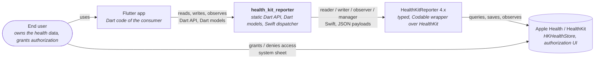

# 3. Context and Scope

## 3.1 Business Context

| Partner | Input to the plugin | Output from the plugin |
| :--- | :--- | :--- |
| Flutter app | Identifiers, `Predicate`s, `DateTime`s, Dart models to save or delete, callbacks | Dart models, `Future`s, `StreamSubscription`s, `PlatformException`s, `InvalidValueException`s |
| HealthKitReporter | Payload JSON (`encoded()`), `QueryHandle`s, `Anchor`s, `HealthKitError`s | Library types parsed from identifiers, `make(from:)` dictionaries, predicates |
| HealthKit | — (only through the library) | — |
| End user | Authorization decisions | — |

## 3.2 Technical Context

| Channel | Technology | Notes |
| :--- | :--- | :--- |
| Dart ⇄ Swift, one-shot | `MethodChannel('health_kit_reporter_method_channel')`, standard message codec | Arguments are maps of primitives and model `map`s; replies are JSON strings, maps, bools, numbers or `FlutterStandardTypedData`. |
| Dart ⇄ Swift, live | `EventChannel('health_kit_reporter_event_channel_<method>_<uuid>')`, one per subscription | Opened by the method call of the live query (ADR 0003). |
| Swift ⇄ HealthKitReporter | Swift API, SwiftPM dependency `from: "4.0.0"` | Callbacks arrive on HealthKit's queues; the plugin hops to the main queue. |

## 3.3 Scope

**In scope:** every public HealthKitReporter feature as a Dart method — authorization, reading (samples, statistics,
series, records, documents, wellbeing, medications, attachments), writing (samples, workouts, series, effort relations,
attachments), observing and anchored queries, background delivery; the example app and its simulator seeding.

**Out of scope:** Android; any HealthKit mapping the library doesn't provide (it is added to the library first, e.g.
routes of a workout); persistence, sync or network; live workout sessions (library ADR 0003).
