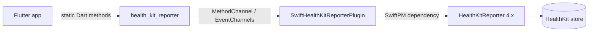

# 3. Context and scope

The plugin connects a Flutter app's Dart code to Apple Health on iOS. It owns no HealthKit logic: the Swift library [HealthKitReporter](https://github.com/kvs-coder/HealthKitReporter) maps HealthKit objects to `Codable` payloads, and the plugin carries them over Flutter's platform channels.

| Neighbour | Exchanged |
| :--- | :--- |
| Flutter app | `Future`s and `StreamSubscription`s of Dart models; `PlatformException`s |
| HealthKitReporter | payloads as JSON (`encoded()`), dictionaries back (`make(from:)`), `QueryHandle`s |
| HealthKit | only through HealthKitReporter; plugin Swift never imports HealthKit |

Out of scope: Android, data leaving the device, any HealthKit mapping the library doesn't provide.
