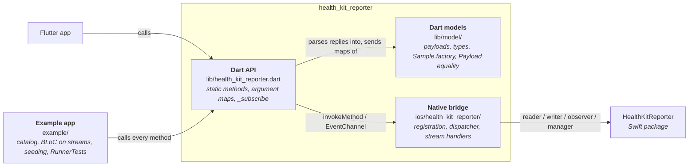
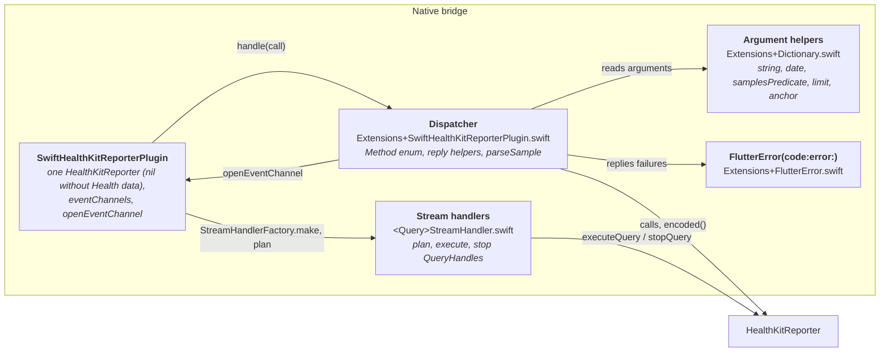

# 5. Building Block View

## 5.1 Level 1 — Containers

## 5.2 Level 2 — Dart

| Block | Location | Responsibility |
| :--- | :--- | :--- |
| `HealthKitReporter` | `lib/health_kit_reporter.dart` | 59 static methods: build the argument map, `invokeMethod`, parse the reply. `_queryArguments` adds `limit` / `predicateOptions`; `_subscribe` turns a live query into a `StreamSubscription` over its own channel. |
| Payload models | `lib/model/payload/` | One class per library payload (`Quantity`, `Workout`, `Audiogram`, `MedicationDoseEvent`, …): `const` constructor, `map`, `fromJson`, `collect`. Samples extend `Sample<Harmonized>`. |
| `Sample` | `lib/model/payload/sample.dart` | Common sample fields; `factory` picks the model by identifier and throws for an unknown one (ADR 0005); `parsed()` keys a sample by kind for saving. |
| `Payload` mixin | `lib/model/payload/payload.dart` | Value equality, hash and `toString` from `map`. |
| `Metadata` | `lib/model/payload/metadata.dart` | Flat metadata of `MetadataValue`s (string, number, bool, date, quantity). |
| Types | `lib/model/type/` | `enum <Name>Type` with HealthKit identifiers and `<Name>TypeFactory.from` / `tryFrom`. |
| Arguments | `lib/model/predicate.dart`, `query_descriptor.dart`, `sample_query_option.dart`, `update_frequency.dart`, `authorization_request_status.dart` | Values Dart sends or receives that aren't payloads. |
| Decorators | `lib/model/decorator/extensions.dart` | `parseNum` / `tryParseNum` (non-finite strings), `parseList`, `parseInts`, `dateFromSeconds`, `DateTime.secondsSinceEpoch`. |

## 5.3 Level 2 — Native bridge (Swift)

| Block | Location | Responsibility |
| :--- | :--- | :--- |
| `SwiftHealthKitReporterPlugin` | `SwiftHealthKitReporterPlugin.swift` | Registers the method channel; creates one `HealthKitReporter` when Health data is available; opens and closes subscription channels. |
| Dispatcher | `Extensions+SwiftHealthKitReporterPlugin.swift` | 58 `Method` cases (`requestClinicalRecordsAuthorization` reuses `requestAuthorization`); `#available` guards; replies through `encoded`, `status`, `send`; on the main queue. |
| Argument helpers | `Extensions+Dictionary.swift` | Typed reads that throw `HealthKitError.invalidValue` for missing or malformed keys. |
| Stream handlers | `ObserverQueryStreamHandler`, `AnchoredObjectQueryStreamHandler`, `StatisticsCollectionQueryStreamHandler`, `QueryActivitySummaryStreamHandler`, `StreamHandlerProtocol`, `Extensions+FlutterStreamHandler`, `StreamHandlerFactory` | `plan` builds the `QueryHandle`s, `onListen` executes them, `onCancel` stops them and closes the channel. |
| Channel names | `MethodChannel.swift`, `EventChannel.swift` | The method channel; event channel cases named like the Dart methods. |
| Privacy manifest | `PrivacyInfo.xcprivacy` | No tracking, no collected data; a SwiftPM resource. |

## 5.4 Example app

| Block | Location | Responsibility |
| :--- | :--- | :--- |
| `Bloc`, `BlocBuilder` | `example/lib/bloc/` | BLoC on plain streams: events in through a `StreamController`, states out on a broadcast stream (ADR 0007). |
| `CatalogBloc`, `SetupBloc` | `example/lib/demo/` | Run rows, keep results and live subscriptions, search and filter; check Health, authorize and seed the simulator (with a timeout). |
| `Catalog`, `DemoRow`, `DemoSection` | `example/lib/demo/catalog.dart`, `demo_row.dart` | A row per public method, grouped by area. |
| `DemoPage`, `demo_widgets.dart` | `example/lib/demo/` | Render states; never call the plugin. |
| `Seeding`, `DemoSamples`, `HealthTypes` | `example/lib/demo/` | Plausible simulator data marked with `HKExternalUUID` `hkr-seed-` / `hkr-demo-`; the types to authorize. |
| Tests | `example/test/`, `example/integration_test/`, `example/ios/RunnerTests/` | Bloc tests; every row against HealthKit; XCTest of the native bridge. |
