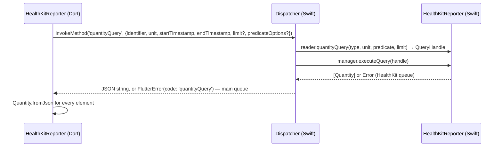
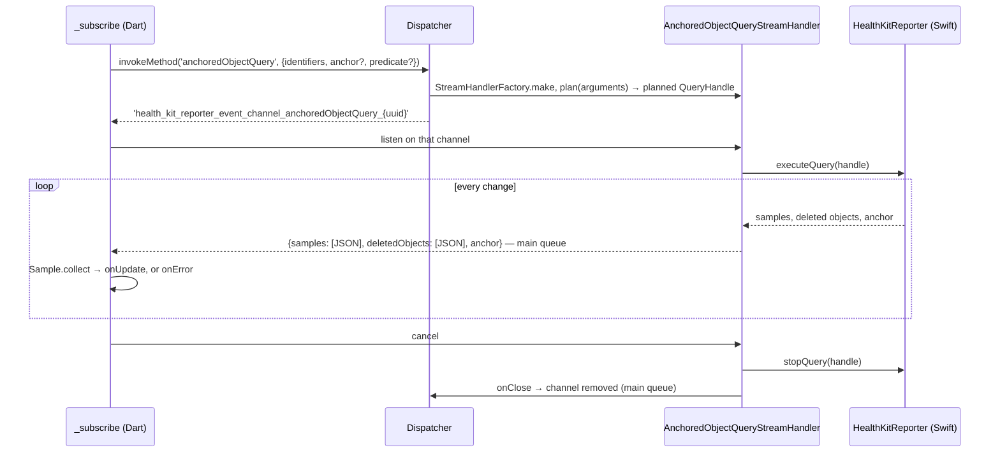
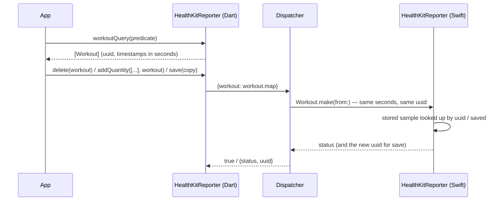

# 6. Runtime View

## 6.1 A method call: `quantityQuery`

Arguments the dispatcher can't read (a missing identifier, an unknown predicate option, a non-positive `limit`) fail the
call before HealthKit is touched.

## 6.2 A live query: `anchoredObjectQuery`

Planning failures (invalid arguments, no Health data) fail the method call and reach `onError` before a channel exists.
A subscription cancelled while it is planned still listens once and cancels, so the native queries are released.

## 6.3 Read, change, save back

Because payload timestamps are seconds in both directions (ADR 0001), a sample read from HealthKit saves with its own dates.

## 6.4 Failure paths

| Situation | What Dart sees |
| :--- | :--- |
| Health data unavailable (some iPads) | `isAvailable()` is false; every other call, live queries included, fails with `PlatformException(code: <method>, message: 'HealthKit data is not available')`. |
| API newer than the device's iOS | `PlatformException` with `HealthKitError.notAvailable`'s message, e.g. "State of mind is available from iOS 18". |
| A payload fails to encode | The whole reply or event fails with the method's code; no element is dropped. |
| A sample of an unknown kind | `InvalidValueException` from `Sample.factory`; the anchored query's update fails and its anchor isn't advanced (ADR 0005). |
| `saveWorkout` stores the workout but not its route | `PlatformException` whose `details` hold the stored workout's JSON. |
