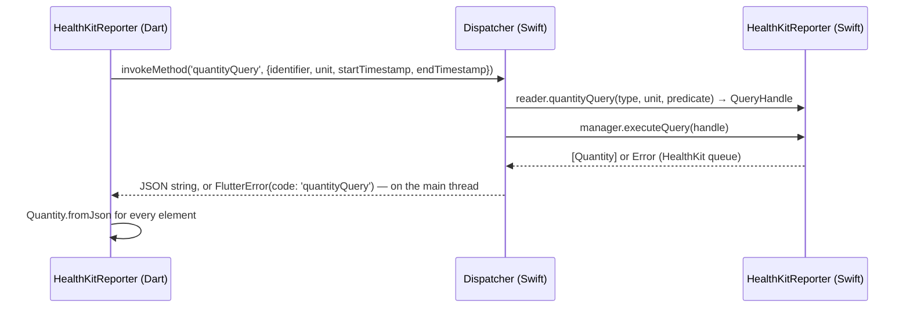
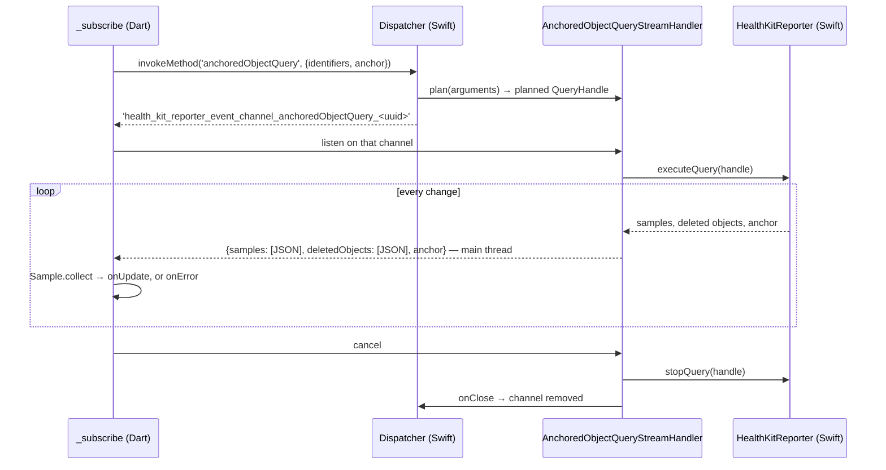

# 6. Runtime view

## A method call: `quantityQuery`

## A live query: `anchoredObjectQuery`

Planning failures (invalid arguments, no Health data) fail the method call and reach `onError` before any channel exists.
