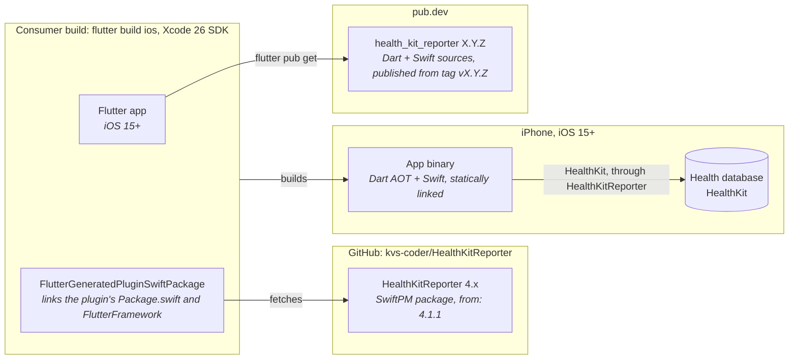

# 7. Deployment View

## 7.1 Distribution

- The plugin ships as source. `flutter pub get` fetches the Dart package; `flutter build ios` turns the plugin's
  `ios/health_kit_reporter/Package.swift` into a dependency of Flutter's generated package, which resolves
  HealthKitReporter from GitHub and links everything into the app. There is no CocoaPods path (ADR 0002).
- Consumer apps need the HealthKit capability, `NSHealthShareUsageDescription` / `NSHealthUpdateUsageDescription`, and
  for some features the clinical records, background delivery and location keys (README, "Setup").
- The plugin's `PrivacyInfo.xcprivacy` is bundled as a SwiftPM resource; apps declare their own data collection.

## 7.2 CI and Release

| Workflow | Trigger | Jobs |
| :--- | :--- | :--- |
| `ci.yml` | PR and push to `master` | **Version / Changelog** (top `CHANGELOG.md` entry matches `pubspec.yaml`); **Analyze / Test** (plugin analyze, tests, coverage ≥ `COVERAGE_THRESHOLD`, example tests); **Example** on macOS (SwiftPM build, `RunnerTests` in a simulator, integration rows without authorization); **SwiftLint**. |
| `release.yml` | push to `master` | release-please keeps a release PR (version in `pubspec.yaml`, example `pubspec.yaml`, README; `CHANGELOG.md` reformatted to `## [X.Y.Z] - dd.MM.yyyy`). Merging it tags `vX.Y.Z`, creates the GitHub release and starts `publish.yml` on the tag. |
| `publish.yml` | a pushed `vX.Y.Z` tag, or `workflow_dispatch` on it from `release.yml` | Checks the tag against `pubspec.yaml`, analyzes, tests and publishes to pub.dev with GitHub's OIDC token (automated publishing, environment `pub.dev`). |

The full integration catalog runs by hand in a simulator whose app has been authorized once
(AGENTS.md §6C), since HealthKit's authorization sheet can't be answered in CI.
